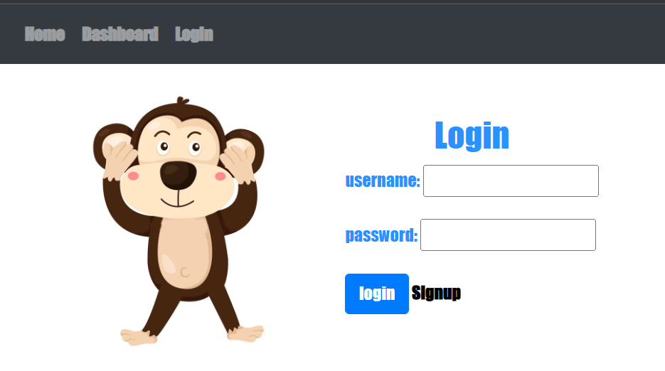

# Raining Cats and Dogs

## Description

Raining Cats and Dogs is created to help pet owners find temporarily places for their pets to stay so that the owners can take their vacation in ease knowing that their pet will be taken care of while being away. The app follows the MVC paradigm in its architectural structure, using Handlebars.js as the templating language, Sequelize as the ORM, and the express-session npm package for authentication.

## Application Deployment

This application is a live site, deployed using Heroku at https://raining-cats-dogs.herokuapp.com/ 

## Documentation Screenshot

## Features

- Login/Logout Feature
- Save pet information
- Choose/reserve places for pets to stay
- Image icon changes depending where cursor is at
- NodeJs
- HTML & CSS
- JavaScript
- Express
- Handlebars

## How to Contribute

If you created an application or package and would like other developers to contribute it, you can include guidelines for how to do so. The [Contributor Covenant](https://www.contributor-covenant.org/) is an industry standard, but you can always write your own if you'd prefer.

## Credits

- Christopher Saechao [TikoMyster](https://github.com/TikoMyster)
- Ruxin Qu [RuxinQu](https://github.com/RuxinQu)
- Richard Nelson [Nelson92](https://github.com/nelson92)
- Lely Huynh [Lely2011](https://github.com/lely2011)

## License

MIT License

Copyright (c) 2022 Christopher Saechao, Ruxin Qu, Richard Nelson, Lely Huynh

Permission is hereby granted, free of charge, to any person obtaining a copy
of this software and associated documentation files (the "Software"), to deal
in the Software without restriction, including without limitation the rights
to use, copy, modify, merge, publish, distribute, sublicense, and/or sell
copies of the Software, and to permit persons to whom the Software is
furnished to do so, subject to the following conditions:

The above copyright notice and this permission notice shall be included in all
copies or substantial portions of the Software.

THE SOFTWARE IS PROVIDED "AS IS", WITHOUT WARRANTY OF ANY KIND, EXPRESS OR
IMPLIED, INCLUDING BUT NOT LIMITED TO THE WARRANTIES OF MERCHANTABILITY,
FITNESS FOR A PARTICULAR PURPOSE AND NONINFRINGEMENT. IN NO EVENT SHALL THE
AUTHORS OR COPYRIGHT HOLDERS BE LIABLE FOR ANY CLAIM, DAMAGES OR OTHER
LIABILITY, WHETHER IN AN ACTION OF CONTRACT, TORT OR OTHERWISE, ARISING FROM,
OUT OF OR IN CONNECTION WITH THE SOFTWARE OR THE USE OR OTHER DEALINGS IN THE
SOFTWARE.

