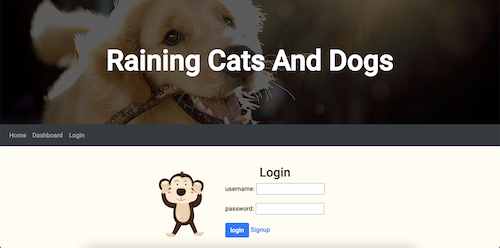

# Raining Cats and Dogs

## Description

Raining Cats and Dogs is created to help pet owners find temporarily places for their pets to stay so that the owners can take their vacation in ease knowing that their pet will be taken care of while being away. The app follows the MVC paradigm in its architectural structure, using Handlebars.js as the templating language, Sequelize as the ORM, and the express-session npm package for authentication.

## Application Deployment

This application is a live site, deployed using Heroku at https://raining-cats-dogs.herokuapp.com/ 

## Documentation Screenshot

## Features

- Login/Logout Feature
- Save pet information
- Choose/reserve places for pets to stay
- Image icon changes depending where cursor is at

## Technologies Used

- [Express](https://expressjs.com)
- [Express-session](https://www.npmjs.com/package/express-session)
- [Express-handlebars](https://www.npmjs.com/package/express-handlebars)
- [Passport-Local](https://www.passportjs.org/packages/passport-local/)
- [Bcrypt](https://www.npmjs.com/package/bcrypt)
- [Sequelize](https://sequelize.org/docs/v6/)
- [Mysql2](https://www.npmjs.com/package/mysql2)
- [Dotenv](https://www.npmjs.com/package/dotenv)
- [Heroku](https://www.heroku.com)
- [Mocha](https://mochajs.org/)
- [Chai](https://www.chaijs.com/)
- [Supertest](https://www.npmjs.com/package/supertest)
- [WebdriverIO](https://webdriver.io/)

## Credits

- [Christopher Saechao](https://github.com/TikoMyster)
- [RuxinQu](https://github.com/RuxinQu)
- [Richard Nelson](https://github.com/nelson92)
- [Lely Huynh](https://github.com/lely2011)

## License

This project is under [MIT license](https://opensource.org/lsicenses/MIT)

## Test
- feature test for the login page is performed using [WebdriverIO](https://webdriver.io/):    
Start the local server and run `npm run wdio`
- server test for the dashboard page is performed using [Supertest](https://www.npmjs.com/package/supertest):      
Run `npm run test`

## How to Contribute

 If you created an application or package and would like other developers to contribute it, you can include guidelines for how to do so. The [Contributor Covenant](https://www.contributor-covenant.org/) is an industry standard, but you can always write your own if you'd prefer.

Copyright (c) 2022 Christopher Saechao, Ruxin Qu, Richard Nelson, Lely Huynh

